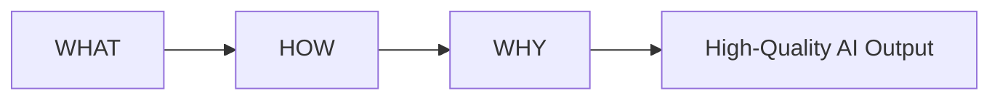

# 🎯 The 3-Rule Prompt Framework

> Write prompts that AI can understand, execute, and optimize.

---

## ✨ Overview

Most AI prompts fail because they are incomplete.

A strong prompt answers three questions:

```text
WHAT → What do you want?
HOW  → How should it be delivered?
WHY  → Why do you need it?
```

Think of it as:



---

# 🧩 The Formula

## 1️⃣ WHAT

Clearly define the task.

Ask yourself:

* What should the AI create?
* What problem should it solve?
* What outcome do I expect?

### Examples

✅ Create a marketing plan.

✅ Write a travel itinerary.

✅ Generate content ideas.

❌ Help me with marketing.

❌ Tell me about travel.

---

## 2️⃣ HOW

Define the format, style, and constraints.

Specify:

* Tone
* Structure
* Length
* Audience
* Writing style

### Examples

```text
HOW:
Present the answer as a table.
Use a professional tone.
Keep it under 500 words.
Include actionable recommendations.
```

---

## 3️⃣ WHY

Provide context.

Context dramatically improves AI output quality.

Tell the AI:

* Who you are
* What you're working on
* Why the result matters

### Examples

```text
WHY:
I am a startup founder preparing for investor meetings
and need a concise strategy document.
```

---

# 🚀 Prompt Template

Copy and reuse:

```text
WHAT:
[Describe the task]

HOW:
[Specify format, tone, style, length, constraints]

WHY:
[Provide context and purpose]
```

---

# 💡 Example 1: Career Development

### WHAT

Create a 90-day career growth plan for me.

### HOW

Provide a week-by-week roadmap with goals,
resources, exercises, and milestones.

### WHY

I want to qualify for a leadership role within the next year.

---

# 🌍 Example 2: Travel Planning

### WHAT

Design a 7-day trip itinerary.

### HOW

Organize by day with activities, food recommendations,
transportation tips, and estimated costs.

### WHY

I'm visiting for the first time and want a balanced experience.

---

# 📱 Example 3: Content Creation

### WHAT

Generate 20 LinkedIn content ideas about AI.

### HOW

Present them in a table with title,
format, and key takeaway.

### WHY

I manage a professional brand and need one month of content.

---

# 💰 Example 4: Personal Finance

### WHAT

Create a beginner investment learning roadmap.

### HOW

Break it into stages with books,
exercises, and milestones.

### WHY

I am new to investing and want a structured path.

---

# 🚀 Example 5: Creative Writing

### WHAT

Create a science-fiction novel outline.

### HOW

Use a three-act structure with character arcs,
plot points, and major conflicts.

### WHY

I am preparing a manuscript and need a strong story framework.

---

# 🎨 Visual Cheat Sheet

```text
┌──────────────────────────────┐
│          GREAT PROMPT        │
├──────────────────────────────┤
│ WHAT → Task                  │
│ HOW  → Format & Style        │
│ WHY  → Context & Purpose     │
└──────────────────────────────┘
```

---

# 🔥 Quick Comparison

❌ Weak Prompt

```text
Write a business plan.
```

✅ Strong Prompt

```text
WHAT:
Write a business plan for a SaaS startup.

HOW:
Use professional language, include financial projections,
and keep it under 1,500 words.

WHY:
I am preparing for an investor pitch next month.
```

---

# 🏆 Golden Rule

The quality of the AI's answer is usually proportional to the quality of the prompt.

```text
More Context
      +
More Clarity
      +
Better Constraints
      =
Better Results
```

Happy Prompting! 🚀
